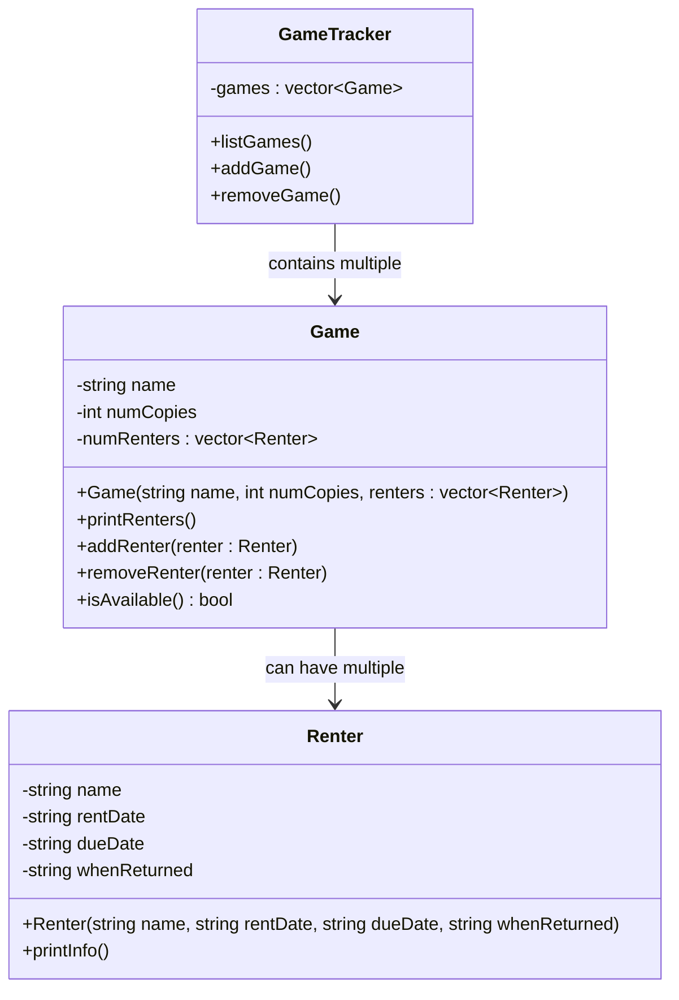

Program specifications: A program to manage lending out board games. Prints out a list of every game, shows how many of each are available. 
If someone is using one of the games, show who is using the game, when they took it, and when they need to bring it back.

nouns: games, renters, games, due date, rent date, number of games returned

attributes: date, name, copies

verbs: game tracker, list games, print renters, print renter info, add renter, remove renter, add game, remove game

---
basic code outline:
```
//GameTracker.h
class GameTracker{
private:
    std::vector<Game> games; 
public:
    void listGames();
    void addGame(const Game& game);
    void removeGame(const Game& game);
};

//Game.h
class Game{
private:
    std::string name;
    int numCopies;
    std::vector<Renter> numRenters;
public:
    Game(std::string& name, int numCopies, std::vector<Renter>& renters);
    void printRenters();
    void addRenter(const Renter& renter);
    void removeRenter(const Renter& renter);
    bool isAvailable();
};

//Renter.h
class Renter{
private:
    std::string name;
    std::string rentDate;
    std::string dueDate;
    std::string whenReturned;
public: 
    Renter(std::string& name, std::string& rentDate, std::string& dueDate, std::string& whenReturned);
    void printInfo();
};

```
---

Mermaid Outline (- is private, + is public):


