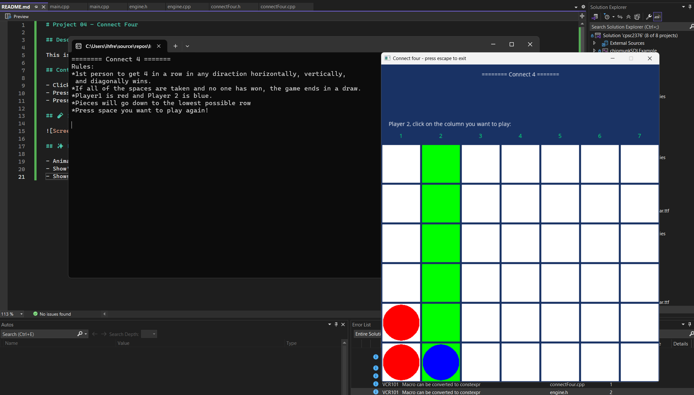

# Project 04 – Connect Four
 
## Description
 
This is Connect Four written in C++ using SDL2. Players take turns placing pieces the mouse. Player 1 is red and Player 2 blue.
The first person to get 4 in a row vertically, horizontally, or diagonally wins. 
Pieces will go down to the lowest possible row.
 
## Controls
 
- Click mouse on the column you want to place
- Press `Enter` at the End Screen to restart the game
- Press `Esc` to exit
 
## Screenshot
 

 
## Extra Features
 
- Rules displayed in the terminal
- Show's who's turn it is using text in SDL
- Shows number of turns when done
- Column that the player is hoving over is highlighted green