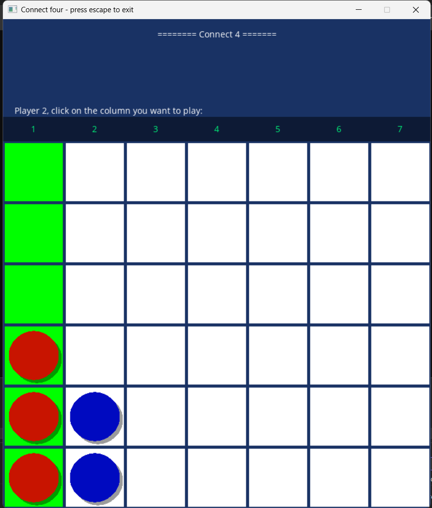

# Project 04 - Connect Four
 
## Brief Description
 
This is Connect Four written in C++ using SDL2. Players take turns placing pieces the mouse. Player 1 is red and Player 2 blue.
The first person to get 4 in a row vertically, horizontally, or diagonally wins. 
Pieces will go down to the lowest possible row. Play only within the game board!
Resetting the game will take you back to the title screen.
 
## Controls
 
- Click mouse on the column you want to place
- Press `Space` at the Title Screen to Start
- Press `Enter` at the End Screen to restart the game
- Press `Esc` to exit
 
## Screenshots
While playing:

Results Screen Example:

 
## Extra Features
 
- Title Screen with rules attached
- Shows who's turn it is using text in SDL
- Shows number of turns when done
- Column that the player is hoving over is highlighted green
- Shows if player is unable to play if the column is full
- If the click inside the window but outside the gameboard, the move won't count
- Drop shadow added to the pieces